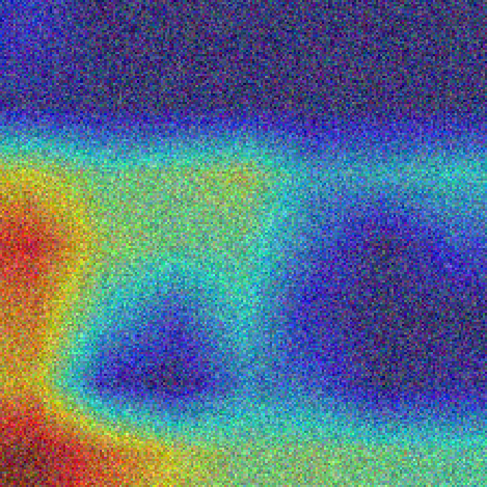

# Oxford‑IIIT‑Pet 宠物分类项目
基于ResNet18实现37类宠物图像分类任务

## 实验指标
- 数据集：Oxford‑IIIT‑Pet，共37类宠物
- 验证集最佳准确率：**93.30%**
- 测试集准确率：**85.47%**
> 注：验证集与测试集准确率存在明显差距，模型存在一定过拟合现象。
- 训练权重输出目录：`checkpoint/best.pth`

## 数据集准备
使用 Oxford‑IIIT‑Pet 数据集，共37类宠物。
将数据集解压放到如下路径：`./data/petdata/oxford‑iiit‑pet/`

> ⚠重要：解压完成后，`./data/petdata/oxford‑iiit‑pet/` 目录下直接看到 `images`、`annotations` 两个文件夹，不要多层嵌套。
> 错误示例：`data/petdata/oxford‑iiit‑pet/oxford‑iiit‑pet/images`（多嵌套一层会报找不到数据集）

💡提示：Windows本地调试若报数据集找不到，可临时改为本机绝对路径；提交代码必须使用相对路径，保证Linux/Colab环境可复现。

```plaintext
./data/petdata/oxford‑iiit‑pet/
├─ annotations
└─ images
```

## 项目文件结构

```
├── models/model.py        # ResNet18模型定义
├── utils/metrics.py      # 评价指标、混淆矩阵
├── utils/gradcam.py      # Grad‑CAM热力图可视化
├── train.py              # 训练入口脚本
├── evaluate.py           # 独立评估脚本
├── requirements.txt      # 依赖包列表
└── README.md             # 项目说明文档
```

## 运行完整流程

```
# 安装依赖
pip install -r requirements.txt

# 模型训练
python train.py

# 模型评估
python evaluate.py
```
### 实验结果
混淆矩阵：

Grad‑CAM热力图可视化：

# Oxford‑IIIT‑Pet 宠物分类项目
基于 ResNet18 迁移学习完成37类宠物图像分类。

## 环境安装
```bash
pip install -r requirements.txt
```
## 一键训练
训练超参：batch_size=32，学习率 lr=1e‑4，epochs=10，参数直接写在 train.py 代码内部。
```bash
python train.py
```
## 模型评估
执行评估脚本，加载最优权重，输出测试准确率，生成混淆矩阵、Grad‑CAM 热力图。
```bash
python evaluate.py
```
## 项目目录
```plaintext
pet_project/
├── data/dataset.py      #数据集与数据增强
├── models/model.py      #ResNet18模型定义
├── utils/metrics.py     #评价指标、混淆矩阵
├── utils/gradcam.py     #Grad‑CAM热力图可视化
├── train.py             #训练入口脚本
├── evaluate.py          #独立评估脚本
├── requirements.txt     #依赖包列表
└── README.md            #项目说明文档
```
数据集：Oxford‑IIIT‑Pet，共 37 类宠物
验证集最佳准确率：93.30%
测试集准确率：85.47%
训练权重输出目录：checkpoint/best.pth
数据集准备
使用 Oxford‑IIIT‑Pet 数据集，共 37 类宠物。
将数据集解压放到如下路径：
`./data/petdata/oxford‑iiit‑pet/`
⚠️重要：解压完成后，`./data/petdata/oxford‑iiit‑pet/` 目录下直接看到 images、annotations 两个文件夹，不要出现多层嵌套。
错误示例：`data/petdata/oxford‑iiit‑pet/oxford‑iiit‑pet/images`（多嵌套一层会报找不到数据集）
💡提示：Windows 本地调试若报数据集找不到，可临时改为本机绝对路径；提交代码必须使用相对路径，保证 Linux/Colab 环境可复现。
```plaintext
./data/petdata/oxford‑iiit‑pet/
├─ annotations
└─ images
```
运行完整流程

```bash
# 安装依赖
pip install -r requirements.txt

# 模型训练
python train.py

# 模型评估
python evaluate.py
```
### 实验结果
混淆矩阵：


Grad‑CAM热力图可视化：


